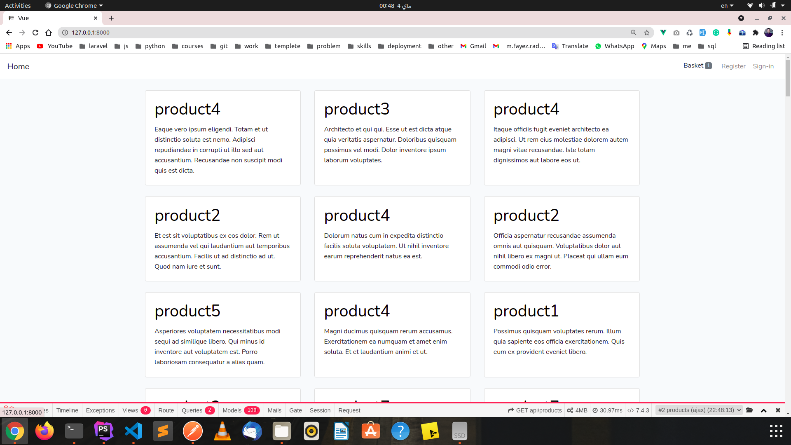
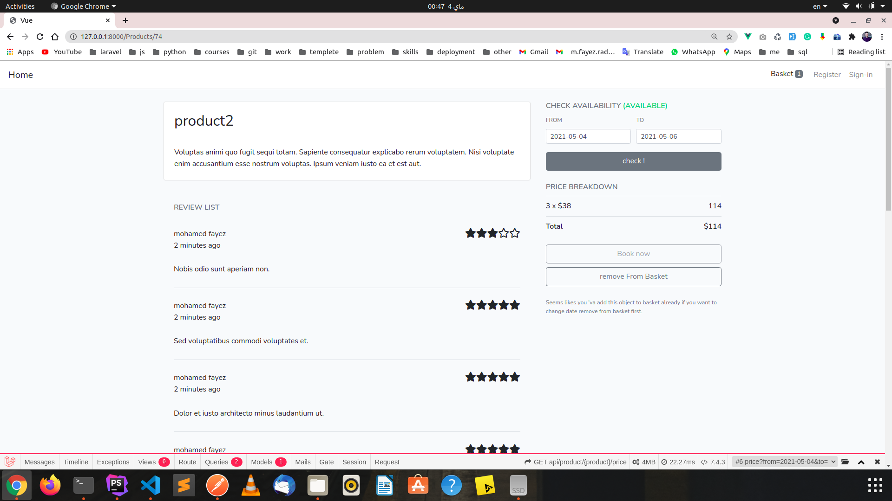
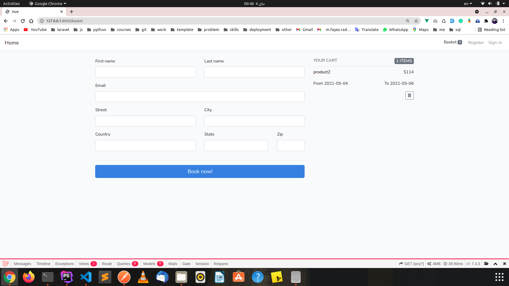

Hello...

To run project

1- php artisan migrate:fresh --seed

2- in localhost

    - php artisan serve

To Browse Website

    goto -> http://127.0.0.1:8000
    

this project is spa using laravel , vue js and vuex  

this project is for display set of products and search for product avibable for interval of time 

user can book product and set review for product

